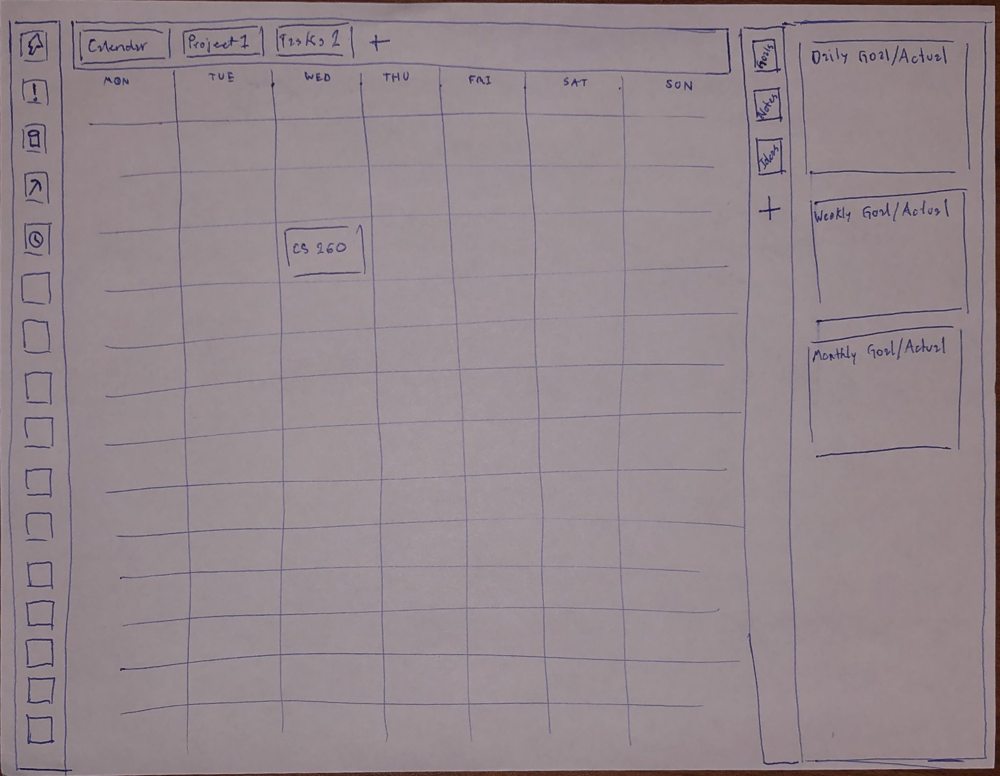

# Startup Project

[Strateu.com](strateu.com) is an innovative new planning website that is designed to take your productivity and organization to the next level. Our platform is fully customizable, allowing you to make it fit your exact needs. From calendars to task lists, our website has everything you need to stay on top of your schedule. With our website, you'll never have to worry about being limited by pre-set templates or features again. Instead, you'll have the freedom to create your own personalized planning system that works for you. Try it out today and see the difference for yourself!

## Key Features

* Module tool that allows for creating a completely customizable system
* Ability to create and manage tasks, projects, and calendars
* Open-source code allows for further customization and integration with other tools
* Notifications and reminders to stay on top of deadlines and important events

## Preview

## Server IP

http://3.138.39.135/

ssh -i production.pem ubuntu@3.138.39.135

[Strateu.com](strateu.com)

